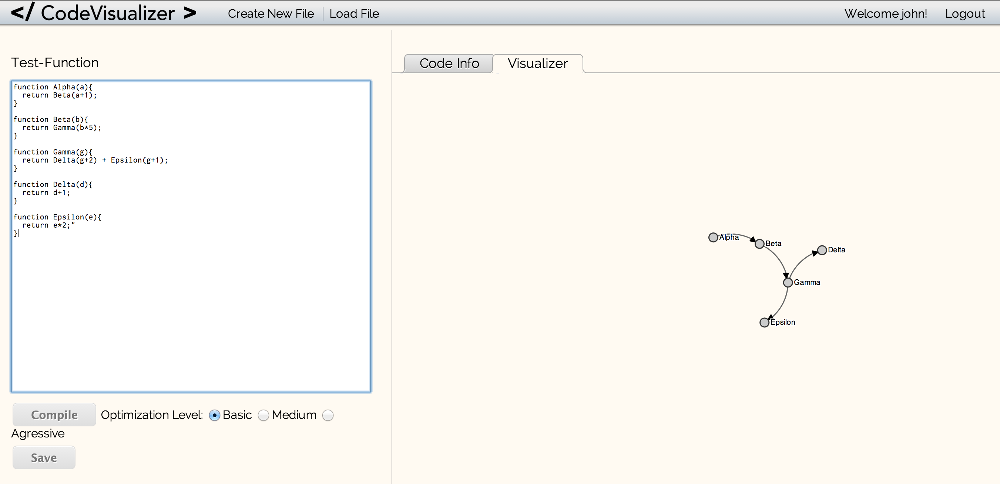

Ethan, alvinw, jkleung1

15237 Unit Project
Code Editor & Visualizer for JS
	Our app will be able to compile JavaScript code using google closure api, which can perform various levels of optimizations, provide warnings, and error checking. Users are able to use a username to save their files to our server. Then users are able to use the visualization feature to see the relationships between functions.

Used API's
	jquery API
	Google clousure compiler API
	jquery UI API
	Reveal API (http://www.zurb.com/playground/reveal-modal-plugin)
	D3 API

Other attributions
	http://css-tricks.com/better-tabs-with-round-out-borders/
	
